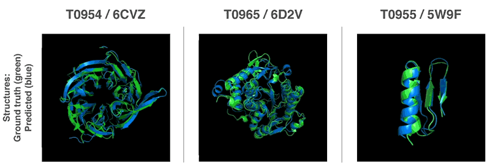
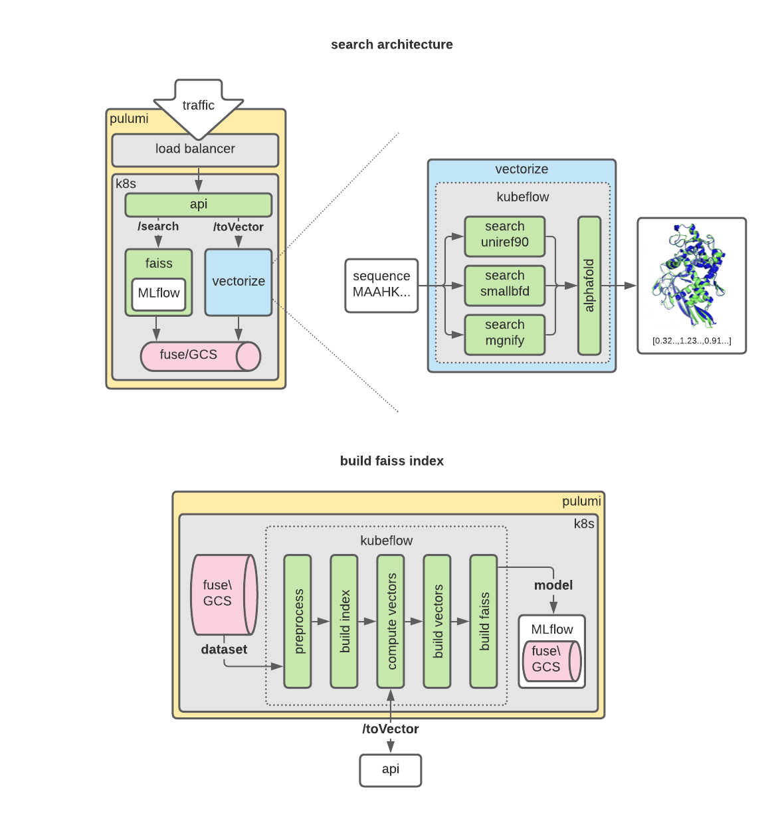

# [WIP] SearchFold

### Protein fold search engine powered by AlphaFold and Faiss

### What is SearchFold?

SearchFold is a neural search engine that allows you to search for similar protein folds given a sequence of amino acids.

We use AlphaFold to calculate vector representations of the folded protein. The vector is then indexed in Faiss, a library that allows us to search for closest neighbors. All running on Kubernetes, provisioned by Pulumi.

### Tech stack:

- AlphaFold https://github.com/deepmind/alphafold
- Faiss https://faiss.ai/
- Pulumi
- Python
- Google Cloud Platform
- Kubernetes
- Kubeflow
